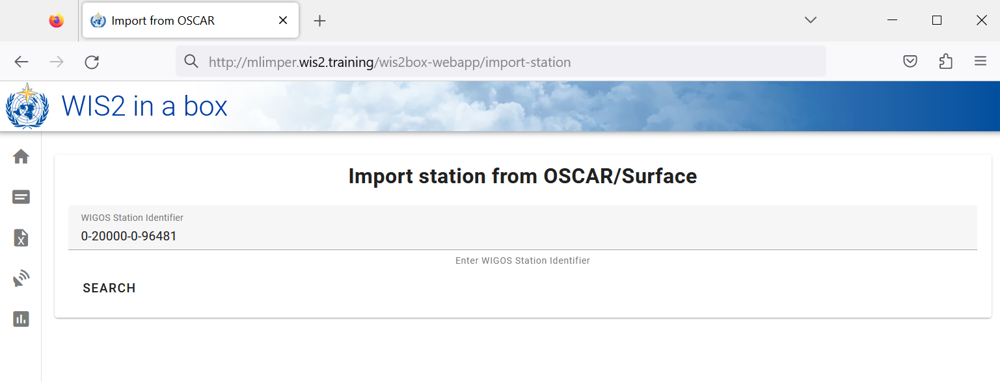

# Konfiguration von Stationsmetadaten

!!! abstract "Lernergebnisse"

    Am Ende dieser praktischen Sitzung werden Sie in der Lage sein:

    - einen Autorisierungstoken für den `collections/stations` Endpunkt zu erstellen
    - Stationsmetadaten zu wis2box hinzuzufügen
    - Stationsmetadaten mit der **wis2box-webapp** zu aktualisieren/löschen

## Einführung

Für den internationalen Datenaustausch zwischen WMO-Mitgliedern ist es wichtig, ein gemeinsames Verständnis der Stationen zu haben, die die Daten erzeugen. Das WMO Integrated Global Observing System (WIGOS) bietet einen Rahmen für die Integration von Beobachtungssystemen und Datenmanagementsystemen. Die **WIGOS Station Identifier (WSI)** wird als eindeutige Referenz der Station verwendet, die einen bestimmten Satz von Beobachtungsdaten produziert hat.

wis2box verfügt über eine Sammlung von Stationsmetadaten, die zur Beschreibung der Stationen dient, welche die Beobachtungsdaten erzeugen, und sollte aus **OSCAR/Surface** abgerufen werden. Die Stationsmetadaten in wis2box werden von den BUFR-Transformationstools verwendet, um zu überprüfen, ob die Eingabedaten einen gültigen WIGOS Station Identifier (WSI) enthalten, und um eine Zuordnung zwischen dem WSI und den Stationsmetadaten bereitzustellen.

## Erstellen eines Autorisierungstokens für collections/stations

Um Stationen über die **wis2box-webapp** zu bearbeiten, müssen Sie zunächst einen Autorisierungstoken erstellen.

Melden Sie sich bei Ihrer Student-VM an und stellen Sie sicher, dass Sie sich im Verzeichnis `wis2box-1.0.0rc1` befinden:

```bash
cd ~/wis2box-1.0.0rc1
```

Melden Sie sich dann mit folgendem Befehl beim **wis2box-management** Container an:

```bash
python3 wis2box-ctl.py login
```

Innerhalb des **wis2box-management** Containers können Sie einen Autorisierungstoken für einen bestimmten Endpunkt mit dem Befehl erstellen: `wis2box auth add-token --path <my-endpoint>`.

Um beispielsweise einen zufällig generierten Token für den Endpunkt `collections/stations` zu verwenden:

```
wis2box auth add-token --path collections/stations
```	

Die Ausgabe sieht wie folgt aus:

```
Continue with token: 7ca20386a131f0de384e6ffa288eb1ae385364b3694e47e3b451598c82e899d1 [y/N]? y
Token successfully created
```

Oder, wenn Sie Ihren eigenen Token für den Endpunkt `collections/stations` definieren möchten, können Sie das folgende Beispiel verwenden:

```
wis2box auth add-token --path collections/stations DataIsMagic
```

Ausgabe:
    
```
Continue with token: DataIsMagic [y/N]? y
Token successfully created
```

Bitte erstellen Sie einen Autorisierungstoken für den Endpunkt `collections/stations` gemäß den obigen Anweisungen.

## Stationsmetadaten mit der **wis2box-webapp** hinzufügen

Die **wis2box-webapp** bietet eine grafische Benutzeroberfläche zur Bearbeitung von Stationsmetadaten.

Öffnen Sie die **wis2box-webapp** in Ihrem Browser, indem Sie zu `http://<your-host>/wis2box-webapp` navigieren:


Und wählen Sie Stationen:


Wenn Sie auf "add new station" klicken, werden Sie aufgefordert, die WIGOS-Stationskennung für die Station anzugeben, die Sie hinzufügen möchten:



!!! note "Stationsmetadaten für 3 oder mehr Stationen hinzufügen"
    Bitte fügen Sie drei oder mehr Stationen zur wis2box-Stationsmetadatensammlung Ihrer wis2box hinzu.
      
    Bitte verwenden Sie wenn möglich Stationen aus Ihrem Land, insbesondere wenn Sie eigene Daten mitgebracht haben.
      
    Wenn Ihr Land keine Stationen in OSCAR/Surface hat, können Sie für diese Übung die folgenden Stationen verwenden:

      - 0-20000-0-91334
      - 0-20000-0-96323 (beachten Sie die fehlende Stationshöhe in OSCAR)
      - 0-20000-0-96749 (beachten Sie die fehlende Stationshöhe in OSCAR)

Wenn Sie auf Suchen klicken, werden die Stationsdaten von OSCAR/Surface abgerufen. Bitte beachten Sie, dass dies einige Sekunden dauern kann.

Überprüfen Sie die von OSCAR/Surface zurückgegebenen Daten und ergänzen Sie fehlende Daten, wo erforderlich. Wählen Sie ein Thema für die Station, geben Sie Ihren Autorisierungstoken für den Endpunkt `collections/stations` ein und klicken Sie auf "save":


Gehen Sie zurück zur Stationsliste und Sie werden die Station sehen, die Sie hinzugefügt haben:


Wiederholen Sie diesen Vorgang, bis Sie mindestens 3 Stationen konfiguriert haben.

!!! tip "Ableitung fehlender Höheninformationen"

    Wenn die Höhe Ihrer Station fehlt, gibt es Online-Dienste, die bei der Suche nach der Höhe mithilfe offener Höhendaten helfen. Ein Beispiel dafür ist die [Open Topo Data API](https://www.opentopodata.org).

    Um beispielsweise die Höhe bei Breitengrad -6.15558 und Längengrad 106.84204 zu erhalten, können Sie die folgende URL in einen neuen Browser-Tab kopieren:

    ```
    https://api.opentopodata.org/v1/aster30m?locations=-6.15558,106.84204
    ```

    Ausgabe:

    ```
    {
      "results": [
        {
          "dataset": "aster30m", 
          "elevation": 7.0, 
          "location": {
            "lat": -6.15558, 
            "lng": 106.84204
          }
        }
      ], 
      "status": "OK"
    }
    ```

## Überprüfen Ihrer Stationsmetadaten

Die Stationsmetadaten werden im Backend von wis2box gespeichert und über die **wis2box-api** verfügbar gemacht.

Wenn Sie einen Browser öffnen und zu `http://<your-host>/oapi/collections/stations/items` navigieren, sehen Sie die von Ihnen hinzugefügten Stationsmetadaten:


!!! note "Überprüfen Ihrer Stationsmetadaten"

    Überprüfen Sie, ob die von Ihnen hinzugefügten Stationen Ihrem Datensatz zugeordnet sind, indem Sie in Ihrem Browser `http://<your-host>/oapi/collections/stations/items` besuchen.

Sie haben auch die Möglichkeit, die Station in der **wis2box-webapp** anzuzeigen/zu aktualisieren/zu löschen. Beachten Sie, dass Sie Ihren Autorisierungstoken für den Endpunkt `collections/stations` angeben müssen, um die Station zu aktualisieren/zu löschen.

!!! note "Stationsmetadaten aktualisieren/löschen"

    Versuchen Sie, die Stationsmetadaten für eine der von Ihnen hinzugefügten Stationen mit der **wis2box-webapp** zu aktualisieren/zu löschen.

## Massenupload von Stationsmetadaten

Beachten Sie, dass wis2box auch die Möglichkeit bietet, Stationsmetadaten "in Masse" aus einer CSV-Datei über die Kommandozeile im **wis2box-management** Container zu laden.

```bash
python3 wis2box-ctl.py login
wis2box metadata station publish-collection -p /data/wis2box/metadata/station/station_list.csv -th origin/a/wis2/centre-id/weather/surface-based-observations/synop
```

Dadurch können Sie eine große Anzahl von Stationen auf einmal hochladen und sie einem bestimmten Thema zuordnen.

Sie können die CSV-Datei mit Excel oder einem Texteditor erstellen und dann in wis2box-host-datadir hochladen, um sie dem **wis2box-management** Container im Verzeichnis `/data/wis2box/` zur Verfügung zu stellen.

Nach einem Massenupload von Stationen wird empfohlen, die Stationen in der **wis2box-webapp** zu überprüfen, um sicherzustellen, dass die Daten korrekt hochgeladen wurden.

Weitere Informationen zur Verwendung dieser Funktion finden Sie in der offiziellen [wis2box-Dokumentation](https://docs.wis2box.wis.wmo.int).

## Fazit

!!! success "Herzlichen Glückwunsch!"
    In dieser praktischen Sitzung haben Sie gelernt, wie man:

    - einen Autorisierungstoken für den Endpunkt `collections/stations` erstellt, der mit der **wis2box-webapp** verwendet werden kann
    - Stationsmetadaten mit der **wis2box-webapp** zu wis2box hinzufügt
    - Stationsmetadaten mit der **wis2box-webapp** anzeigt/aktualisiert/löscht