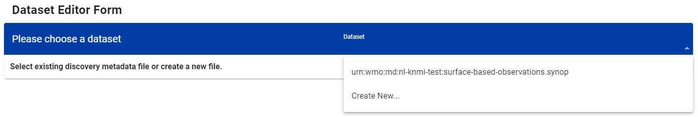

# Konfiguration von Datensätzen in wis2box

!!! abstract "Lernergebnisse"
    Am Ende dieser praktischen Sitzung werden Sie in der Lage sein:

    - einen neuen Datensatz zu erstellen
    - Entdeckungsmetadaten für einen Datensatz zu erstellen
    - Datenzuordnungen für einen Datensatz zu konfigurieren
    - eine WIS2-Benachrichtigung mit einem WCMP2-Datensatz zu veröffentlichen
    - Ihren Datensatz zu aktualisieren und erneut zu veröffentlichen

## Einführung

wis2box verwendet Datensätze, die mit Entdeckungsmetadaten und Datenzuordnungen verknüpft sind.

Entdeckungsmetadaten werden verwendet, um einen WCMP2-Datensatz (WMO Core Metadata Profile 2) zu erstellen, der über eine WIS2-Benachrichtigung geteilt wird, die auf Ihrem wis2box-Broker veröffentlicht wird.

Die Datenzuordnungen werden verwendet, um ein Daten-Plugin mit Ihren Eingabedaten zu verknüpfen, wodurch Ihre Daten vor der Veröffentlichung über die WIS2-Benachrichtigung transformiert werden können.

In dieser Sitzung werden Sie durch die Erstellung eines neuen Datensatzes, die Erstellung von Entdeckungsmetadaten und die Konfiguration von Datenzuordnungen geführt. Sie werden Ihren Datensatz in der wis2box-API überprüfen und die WIS2-Benachrichtigung für Ihre Entdeckungsmetadaten überprüfen.

## Vorbereitung

Verbinden Sie sich mit Ihrem Broker über MQTT Explorer.

Anstatt Ihre internen Broker-Anmeldedaten zu verwenden, nutzen Sie die öffentlichen Anmeldedaten `everyone/everyone`:


!!! Note

    Sie müssen die Anmeldedaten Ihres internen Brokers niemals mit externen Benutzern teilen. Der Benutzer 'everyone' ist ein öffentlicher Benutzer, um das Teilen von WIS2-Benachrichtigungen zu ermöglichen.

    Die Anmeldedaten `everyone/everyone` haben nur Lesezugriff auf das Thema 'origin/a/wis2/#'. Dies ist das Thema, unter dem die WIS2-Benachrichtigungen veröffentlicht werden. Der Global Broker kann sich mit diesen öffentlichen Anmeldedaten anmelden, um die Benachrichtigungen zu empfangen.
    
    Der Benutzer 'everyone' sieht keine internen Themen und kann keine Nachrichten veröffentlichen.
    
Öffnen Sie einen Browser und öffnen Sie eine Seite zu `http://<your-host>/wis2box-webapp`. Stellen Sie sicher, dass Sie angemeldet sind und auf die Seite 'dataset editor' zugreifen können.

Schauen Sie im Abschnitt [Initialisierung von wis2box](/practical-sessions/initializing-wis2box) nach, wenn Sie sich nicht erinnern können, wie Sie sich mit dem Broker verbinden oder auf die wis2box-webapp zugreifen können.

## Erstellen eines Autorisierungstokens für processes/wis2box

Sie benötigen ein Autorisierungstoken für den Endpunkt 'processes/wis2box', um Ihren Datensatz zu veröffentlichen.

Um ein Autorisierungstoken zu erstellen, greifen Sie über SSH auf Ihre Trainings-VM zu und verwenden Sie die folgenden Befehle, um sich beim wis2box-management-Container anzumelden:

```bash
cd ~/wis2box-1.0.0rc1
python3 wis2box-ctl.py login
```

Führen Sie dann den folgenden Befehl aus, um ein zufällig generiertes Autorisierungstoken für den Endpunkt 'processes/wis2box' zu erstellen:

```bash
wis2box auth add-token --path processes/wis2box
```

Sie können auch ein Token mit einem bestimmten Wert erstellen, indem Sie das Token als Argument für den Befehl angeben:

```bash
wis2box auth add-token --path processes/wis2box MyS3cretToken
```

Stellen Sie sicher, dass Sie den Token-Wert kopieren und auf Ihrem lokalen Computer speichern, da Sie ihn später benötigen werden.

Sobald Sie Ihr Token haben, können Sie den wis2box-management-Container verlassen:

```bash
exit
```

## Erstellen eines neuen Datensatzes in der wis2box-webapp

Navigieren Sie zur Seite 'dataset editor' in der wis2box-webapp Ihrer wis2box-Instanz, indem Sie zu `http://<your-host>/wis2box-webapp` gehen und 'dataset editor' aus dem Menü auf der linken Seite auswählen.

Auf der Seite 'dataset editor' klicken Sie unter der Registerkarte 'Datasets' auf "Create New ...":


Ein Popup-Fenster erscheint und fordert Sie auf, Folgendes anzugeben:

- **Centre ID**: Dies ist das Akronym der Agentur (in Kleinbuchstaben und ohne Leerzeichen), wie vom WMO-Mitglied angegeben, das das für die Veröffentlichung der Daten verantwortliche Datenzentrum identifiziert.
- **Data Type**: Der Typ der Daten, für die Sie Metadaten erstellen. Sie können zwischen der Verwendung einer vordefinierten Vorlage oder der Auswahl von 'other' wählen. Wenn 'other' ausgewählt wird, müssen mehr Felder manuell ausgefüllt werden.

!!! Note "Centre ID"

    Ihre Centre-ID sollte mit der TLD Ihres Landes beginnen, gefolgt von einem Bindestrich (`-`) und einem abgekürzten Namen Ihrer Organisation (zum Beispiel `fr-meteofrance`). Die Centre-ID muss in Kleinbuchstaben sein und nur alphanumerische Zeichen verwenden. Die Dropdown-Liste zeigt alle derzeit bei WIS2 registrierten Centre-IDs sowie alle Centre-IDs, die Sie bereits in wis2box erstellt haben.

!!! Note "Data Type Templates"

    Das Feld *Data Type* ermöglicht es Ihnen, aus einer Liste von Vorlagen auszuwählen, die im wis2box-webapp-Datensatzeditor verfügbar sind. Eine Vorlage füllt das Formular mit vorgeschlagenen Standardwerten vor, die für den Datentyp geeignet sind. Dazu gehören vorgeschlagene Titel und Schlüsselwörter für die Metadaten und vorkonfigurierte Daten-Plugins. Das Thema wird auf das Standardthema für den Datentyp festgelegt.

    Für das Training verwenden wir den Datentyp *weather/surface-based-observations/synop*, der Daten-Plugins enthält, die sicherstellen, dass die Daten vor der Veröffentlichung in das BUFR-Format umgewandelt werden.

    Wenn Sie CAP-Warnungen mit wis2box veröffentlichen möchten, verwenden Sie die Vorlage *weather/advisories-warnings*. Diese Vorlage enthält ein Daten-Plugin, das überprüft, ob die Eingabedaten eine gültige CAP-Warnung sind, bevor sie veröffentlicht werden. Um CAP-Warnungen zu erstellen und über wis2box zu veröffentlichen, können Sie [CAP Composer](https://github.com/wmo-raf/cap-composer) verwenden.

Bitte wählen Sie eine für Ihre Organisation geeignete Centre-ID.

Für **Data Type** wählen Sie **weather/surface-based-observations/synop**:


Klicken Sie auf *continue to form*, um fortzufahren. Ihnen wird nun das **Dataset Editor Form** präsentiert.

Da Sie den Datentyp **weather/surface-based-observations/synop** ausgewählt haben, wird das Formular mit einigen Anfangswerten für diesen Datentyp vorausgefüllt.

## Erstellen von Entdeckungsmetadaten

Mit dem Dataset Editor-Formular können Sie die Entdeckungsmetadaten für Ihren Datensatz bereitstellen, die der wis2box-management-Container zur Veröffentlichung eines WCMP2-Datensatzes verwenden wird.

Da Sie den Datentyp 'weather/surface-based-observations/synop' ausgewählt haben, wird das Formular mit einigen Standardwerten vorausgefüllt.

Bitte ersetzen Sie die automatisch generierte 'Local ID' durch einen beschreibenden Namen für Ihren Datensatz, z.B. 'synop-dataset-wis2training':


Überprüfen Sie den Titel und die Schlüsselwörter, aktualisieren Sie sie bei Bedarf und geben Sie eine Beschreibung für Ihren Datensatz an.

Beachten Sie, dass es Optionen gibt, die 'WMO Data Policy' von 'core' auf 'recommended' zu ändern oder Ihre Standard-Metadaten-ID zu ändern. Bitte behalten Sie die Datenpolitik als 'core' bei und verwenden Sie die Standard-Metadaten-ID.

Als Nächstes überprüfen Sie den Abschnitt, der Ihre 'Temporal Properties' und 'Spatial Properties' definiert. Sie können den Begrenzungsrahmen anpassen, indem Sie die Felder 'North Latitude', 'South Latitude', 'East Longitude' und 'West Longitude' aktualisieren:


Als Nächstes füllen Sie den Abschnitt aus, der die 'Contact Information of the Data Provider' definiert:


Schließlich füllen Sie den Abschnitt aus, der die 'Data Quality Information' definiert:

Sobald Sie alle Abschnitte ausgefüllt haben, klicken Sie auf 'VALIDATE FORM' und überprüfen Sie das Formular auf Fehler:


Wenn Fehler auftreten, korrigieren Sie diese und klicken Sie erneut auf 'VALIDATE FORM'.

Stellen Sie sicher, dass keine Fehler vorliegen und dass Sie ein Popup erhalten, das anzeigt, dass Ihr Formular validiert wurde:


Bevor Sie Ihren Datensatz einreichen, überprüfen Sie als Nächstes die Datenzuordnungen für Ihren Datensatz.

## Konfigurieren von Datenzuordnungen

Da Sie eine Vorlage zur Erstellung Ihres Datensatzes verwendet haben, wurden die Datensatzzuordnungen mit den Standard-Plugins für den Datentyp 'weather/surface-based-observations/synop' vorausgefüllt. Daten-Plugins werden in der wis2box verwendet, um Daten zu transformieren, bevor sie über die WIS2-Benachrichtigung veröffentlicht werden.


Beachten Sie, dass Sie auf die Schaltfläche "update" klicken können, um Einstellungen für das Plugin wie Dateierweiterung und Dateimuster zu ändern. Sie können die Standardeinstellungen vorerst beibehalten. In einer späteren Sitzung erfahren Sie mehr über BUFR und die Transformation von Daten in das BUFR-Format.

## Einreichen Ihres Datensatzes

Schließlich können Sie auf 'submit' klicken, um Ihren Datensatz zu veröffentlichen.

Sie müssen das Autorisierungstoken für 'processes/wis2box' angeben, das Sie zuvor erstellt haben. Wenn Sie dies noch nicht getan haben, können Sie ein neues Token erstellen, indem Sie den Anweisungen im Vorbereitungsabschnitt folgen.

Überprüfen Sie, ob Sie nach dem Einreichen Ihres Datensatzes die folgende Meldung erhalten, die anzeigt, dass der Datensatz erfolgreich eingereicht wurde:


Nachdem Sie auf 'OK' geklickt haben, werden Sie zur Startseite des Dataset Editors weitergeleitet. Wenn Sie jetzt auf die Registerkarte 'Dataset' klicken, sollten Sie Ihren neuen Datensatz aufgelistet sehen:



## Überprüfen der WIS2-Benachrichtigung für Ihre Entdeckungsmetadaten

Gehen Sie zu MQTT Explorer. Wenn Sie mit dem Broker verbunden waren, sollten Sie eine neue WIS2-Benachrichtigung sehen, die unter dem Thema `origin/a/wis2/<your-centre-id>/metadata` veröffentlicht wurde:


Überprüfen Sie den Inhalt der WIS2-Benachrichtigung, die Sie veröffentlicht haben. Sie sollten ein JSON mit einer Struktur sehen, die dem WIS Notification Message (WNM)-Format entspricht.

!!! question

    Unter welchem Thema wird die WIS2-Benachrichtigung veröffentlicht?

??? success "Klicken Sie, um die Antwort anzuzeigen"

    Die WIS2-Benachrichtigung wird unter dem Thema `origin/a/wis2/<your-centre-id>/metadata` veröffentlicht.

!!! question
    
    Versuchen Sie, den Titel, die Beschreibung und die Schlüsselwörter, die Sie in den Entdeckungsmetadaten angegeben haben, in der WIS2-Benachrichtigung zu finden. Können Sie sie finden?