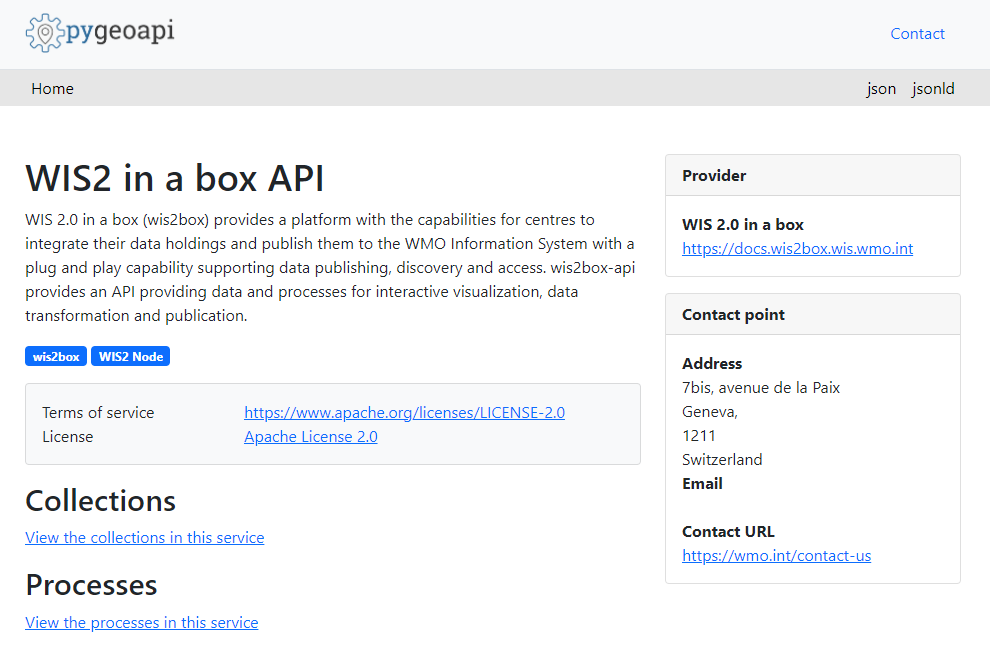
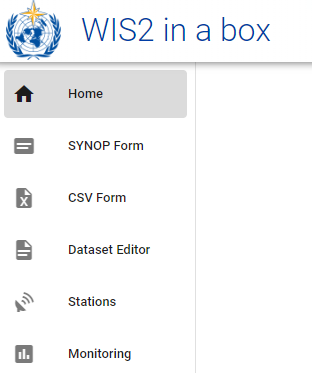

# Initialisierung von wis2box

!!! abstract "Lernziele"

    Am Ende dieser praktischen Sitzung werden Sie in der Lage sein:

    - das Skript `wis2box-create-config.py` auszuführen, um die Anfangskonfiguration zu erstellen
    - wis2box zu starten und den Status seiner Komponenten zu überprüfen
    - auf die **wis2box-webapp**, API, MinIO UI und das Grafana-Dashboard in einem Browser zuzugreifen
    - sich mit dem lokalen **wis2box-broker** über MQTT Explorer zu verbinden

!!! note

    Die aktuellen Schulungsmaterialien verwenden wis2box-1.0.0rc1. 
    
    Siehe [accessing-your-student-vm](accessing-your-student-vm.md) für Anweisungen zum Herunterladen und Installieren des wis2box-Softwarepakets, wenn Sie diese Schulung außerhalb einer lokalen Schulungssitzung durchführen.

## Vorbereitung

Melden Sie sich mit Ihrem Benutzernamen und Passwort an Ihrer zugewiesenen VM an und stellen Sie sicher, dass Sie sich im Verzeichnis `wis2box-1.0.0rc1` befinden:

```bash
cd ~/wis2box-1.0.0rc1
```

## Erstellen der Anfangskonfiguration

Die Anfangskonfiguration für die wis2box erfordert:

- eine Umgebungsdatei `wis2box.env`, die die Konfigurationsparameter enthält
- ein Verzeichnis auf dem Host-Rechner, das zwischen dem Host-Rechner und den wis2box-Containern geteilt wird, definiert durch die Umgebungsvariable `WIS2BOX_HOST_DATADIR`

Das Skript `wis2box-create-config.py` kann verwendet werden, um die Anfangskonfiguration Ihrer wis2box zu erstellen. 

Es wird Ihnen eine Reihe von Fragen stellen, um Ihre Konfiguration einzurichten.

Sie können die Konfigurationsdateien nach Abschluss des Skripts überprüfen und aktualisieren.

Führen Sie das Skript wie folgt aus:

```bash
python3 wis2box-create-config.py
```

### wis2box-host-data Verzeichnis

Das Skript wird Sie bitten, das Verzeichnis einzugeben, das für die Umgebungsvariable `WIS2BOX_HOST_DATADIR` verwendet werden soll.

Beachten Sie, dass Sie den vollständigen Pfad zu diesem Verzeichnis angeben müssen.

Wenn Ihr Benutzername beispielsweise `username` ist, lautet der vollständige Pfad zum Verzeichnis `/home/username/wis2box-data`:

```{.copy}
username@student-vm-username:~/wis2box-1.0.0rc1$ python3 wis2box-create-config.py
Please enter the directory to be used for WIS2BOX_HOST_DATADIR:
/home/username/wis2box-data
The directory to be used for WIS2BOX_HOST_DATADIR will be set to:
    /home/username/wis2box-data
Is this correct? (y/n/exit)
y
The directory /home/username/wis2box-data has been created.
```

### wis2box URL

Als Nächstes werden Sie aufgefordert, die URL für Ihre wis2box einzugeben. Dies ist die URL, die für den Zugriff auf die wis2box-Webanwendung, API und UI verwendet wird.

Bitte verwenden Sie `http://<Ihr-Hostname-oder-IP>` als URL.

```{.copy}
Please enter the URL of the wis2box:
 For local testing the URL is http://localhost
 To enable remote access, the URL should point to the public IP address or domain name of the server hosting the wis2box.
http://username.wis2.training
The URL of the wis2box will be set to:
  http://username.wis2.training
Is this correct? (y/n/exit)
```

### WEBAPP, STORAGE und BROKER Passwörter

Sie können die Option der zufälligen Passwortgenerierung wählen, wenn Sie nach `WIS2BOX_WEBAPP_PASSWORD`, `WIS2BOX_STORAGE_PASSWORD`, `WIS2BOX_BROKER_PASSWORD` gefragt werden, oder Ihre eigenen definieren.

Machen Sie sich keine Sorgen, diese Passwörter zu merken, sie werden in der Datei `wis2box.env` in Ihrem wis2box-1.0.0rc1-Verzeichnis gespeichert.

### Überprüfung von `wis2box.env`

Sobald das Skript abgeschlossen ist, überprüfen Sie den Inhalt der Datei `wis2box.env` in Ihrem aktuellen Verzeichnis:

```bash
cat ~/wis2box-1.0.0rc1/wis2box.env
```

Oder überprüfen Sie den Inhalt der Datei über WinSCP.

!!! question

    Was ist der Wert von WISBOX_BASEMAP_URL in der wis2box.env-Datei?

??? success "Klicken Sie, um die Antwort anzuzeigen"

    Der Standardwert für WIS2BOX_BASEMAP_URL ist `https://{s}.tile.openstreetmap.org/{z}/{x}/{y}.png`.

    Diese URL verweist auf den OpenStreetMap-Tile-Server. Wenn Sie einen anderen Kartenanbieter verwenden möchten, können Sie diese URL ändern, um auf einen anderen Tile-Server zu verweisen.

!!! question 

    Was ist der Wert der Umgebungsvariable WIS2BOX_STORAGE_DATA_RETENTION_DAYS in der wis2box.env-Datei?

??? success "Klicken Sie, um die Antwort anzuzeigen"

    Der Standardwert für WIS2BOX_STORAGE_DATA_RETENTION_DAYS beträgt 30 Tage. Sie können diesen Wert auf eine andere Anzahl von Tagen ändern, wenn Sie möchten.
    
    Der wis2box-management-Container führt täglich einen Cronjob aus, um Daten, die älter als die durch WIS2BOX_STORAGE_DATA_RETENTION_DAYS definierte Anzahl von Tagen sind, aus dem `wis2box-public`-Bucket und dem API-Backend zu entfernen:
    
    ```{.copy}
    0 0 * * * su wis2box -c "wis2box data clean --days=$WIS2BOX_STORAGE_DATA_RETENTION_DAYS"
    ```

!!! note

    Die Datei `wis2box.env` enthält Umgebungsvariablen, die die Konfiguration Ihrer wis2box definieren. Weitere Informationen finden Sie in der [wis2box-Dokumentation](https://docs.wis2box.wis.wmo.int/en/latest/reference/configuration.html).

    Bearbeiten Sie die Datei `wis2box.env` nur, wenn Sie sich der Änderungen sicher sind, die Sie vornehmen. Falsche Änderungen können dazu führen, dass Ihre wis2box nicht mehr funktioniert.

    Teilen Sie den Inhalt Ihrer `wis2box.env`-Datei mit niemandem, da sie sensible Informationen wie Passwörter enthält.


## wis2box starten

Stellen Sie sicher, dass Sie sich im Verzeichnis befinden, das die Definitionsdateien des wis2box-Softwarepakets enthält:

```{.copy}
cd ~/wis2box-1.0.0rc1
```

Starten Sie wis2box mit dem folgenden Befehl:

```{.copy}
python3 wis2box-ctl.py start
```

Wenn Sie diesen Befehl zum ersten Mal ausführen, sehen Sie die folgende Ausgabe:

```
No docker-compose.images-*.yml files found, creating one
Current version=Undefined, latest version=1.0.0rc1
Would you like to update ? (y/n/exit)
```

Wählen Sie `y` und das Skript erstellt die Datei `docker-compose.images-1.0.0rc1.yml`, lädt die erforderlichen Docker-Images herunter und startet die Dienste.

Das Herunterladen der Images kann je nach Geschwindigkeit Ihrer Internetverbindung einige Zeit dauern. Dieser Schritt ist nur beim ersten Start von wis2box erforderlich.

Überprüfen Sie den Status mit dem folgenden Befehl:

```{.copy}
python3 wis2box-ctl.py status
```

Wiederholen Sie diesen Befehl, bis alle Dienste aktiv und laufend sind.

!!! note "wis2box und Docker"
    wis2box läuft als eine Reihe von Docker-Containern, die von docker-compose verwaltet werden.
    
    Die Dienste sind in den verschiedenen `docker-compose*.yml` definiert, die im Verzeichnis `~/wis2box-1.0.0rc1/` zu finden sind.
    
    Das Python-Skript `wis2box-ctl.py` wird verwendet, um die zugrunde liegenden Docker Compose-Befehle auszuführen, die die wis2box-Dienste steuern.

    Sie müssen die Details der Docker-Container nicht kennen, um das wis2box-Softwarepaket auszuführen, aber Sie können die `docker-compose*.yml`-Dateien inspizieren, um zu sehen, wie die Dienste definiert sind. Wenn Sie mehr über Docker erfahren möchten, finden Sie weitere Informationen in der [Docker-Dokumentation](https://docs.docker.com/).

Um sich beim wis2box-management-Container anzumelden, verwenden Sie den folgenden Befehl:

```{.copy}
python3 wis2box-ctl.py login
```

Innerhalb des wis2box-management-Containers können Sie verschiedene Befehle ausführen, um Ihre wis2box zu verwalten, wie zum Beispiel:

- `wis2box auth add-token --path processes/wis2box` : um ein Autorisierungstoken für den Endpunkt `processes/wis2box` zu erstellen
- `wis2box data clean --days=<Anzahl-der-Tage>` : um Daten, die älter als eine bestimmte Anzahl von Tagen sind, aus dem `wis2box-public`-Bucket zu bereinigen

Um den Container zu verlassen und zum Host-Rechner zurückzukehren, verwenden Sie den folgenden Befehl:

```{.copy}
exit
```

Führen Sie den folgenden Befehl aus, um die auf Ihrem Host-Rechner laufenden Docker-Container anzuzeigen:

```{.copy}
docker ps
```

Sie sollten die folgenden laufenden Container sehen:

- wis2box-management
- wis2box-api
- wis2box-minio
- wis2box-webapp
- wis2box-auth
- wis2box-ui
- wis2downloader
- elasticsearch
- elasticsearch-exporter
- nginx
- mosquitto
- prometheus
- grafana
- loki

Diese Container sind Teil des wis2box-Softwarepakets und bieten die verschiedenen Dienste, die zum Betrieb der wis2box erforderlich sind.

Führen Sie den folgenden Befehl aus, um die auf Ihrem Host-Rechner laufenden Docker-Volumes anzuzeigen:

```{.copy}
docker volume ls
```

Sie sollten die folgenden Volumes sehen:

- wis2box_project_auth-data
- wis2box_project_es-data
- wis2box_project_htpasswd
- wis2box_project_minio-data
- wis2box_project_prometheus-data
- wis2box_project_loki-data

Sowie einige anonyme Volumes, die von den verschiedenen Containern verwendet werden.

Die mit `wis2box_project_` beginnenden Volumes werden verwendet, um persistente Daten für die verschiedenen Dienste im wis2box-Softwarepaket zu speichern.

## wis2box API

Die wis2box enthält eine API (Application Programming Interface), die Datenzugriff und Prozesse für interaktive Visualisierung, Datentransformation und Veröffentlichung bietet.

Öffnen Sie einen neuen Tab und navigieren Sie zur Seite `http://<Ihr-Host>/oapi`.



Dies ist die Startseite der wis2box-API (läuft über den **wis2box-api**-Container).

!!! question
     
     Welche Sammlungen sind derzeit verfügbar?

??? success "Klicken Sie, um die Antwort anzuzeigen"
    
    Um die derzeit über die API verfügbaren Sammlungen anzuzeigen, klicken Sie auf `View the collections in this service`:

    

    Die folgenden Sammlungen sind derzeit verfügbar:

    - Stations
    - Data notifications
    - Discovery metadata


!!! question

    Wie viele Datenbenachrichtigungen wurden veröffentlicht?

??? success "Klicken Sie, um die Antwort anzuzeigen"

    Klicken Sie auf "Data notifications" und dann auf `Browse through the items of "Data Notifications"`. 
    
    Sie werden feststellen, dass auf der Seite "No items" steht, da noch keine Datenbenachrichtigungen veröffentlicht wurden.

## wis2box webapp

Öffnen Sie einen Webbrowser und besuchen Sie die Seite `http://<Ihr-Host>/wis2box-webapp`.

Sie sehen ein Popup, das nach Ihrem Benutzernamen und Passwort fragt. Verwenden Sie den Standardbenutzernamen `wis2box-user` und das in der Datei `wis2box.env` definierte `WIS2BOX_WEBAPP_PASSWORD` und klicken Sie auf "Sign in":

!!! note 

    Überprüfen Sie Ihre wis2box.env auf den Wert Ihres WIS2BOX_WEBAPP_PASSWORD. Sie können den folgenden Befehl verwenden, um den Wert dieser Umgebungsvariable zu überprüfen:

    ```{.copy}
    cat ~/wis2box-1.0.0rc1/wis2box.env | grep WIS2BOX_WEBAPP_PASSWORD
    ```

Nach der Anmeldung bewegen Sie Ihre Maus zum Menü auf der linken Seite, um die in der wis2box-Webanwendung verfügbaren Optionen zu sehen:



Dies ist die wis2