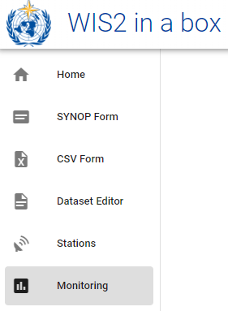

# Überwachung von WIS2-Benachrichtigungen

!!! abstract "Lernergebnisse"

    Am Ende dieser praktischen Sitzung werden Sie in der Lage sein:
    
    - den wis2box-Workflow durch Hochladen von Daten in MinIO mit dem Befehl `wis2box data ingest` auszulösen
    - Warnungen und Fehler im Grafana-Dashboard anzuzeigen
    - den Inhalt der veröffentlichten Daten zu überprüfen

## Einführung

Das **Grafana-Dashboard** verwendet Daten von Prometheus und Loki, um den Status Ihrer wis2box anzuzeigen. Prometheus speichert Zeitreihendaten aus den gesammelten Metriken, während Loki die Protokolle der Container speichert, die auf Ihrer wis2box-Instanz laufen. Diese Daten ermöglichen es Ihnen zu überprüfen, wie viele Daten in MinIO empfangen werden und wie viele WIS2-Benachrichtigungen veröffentlicht werden, sowie ob Fehler in den Protokollen erkannt wurden.

Um den Inhalt der WIS2-Benachrichtigungen zu sehen, die zu verschiedenen Themen Ihrer wis2box veröffentlicht werden, können Sie den Tab 'Monitor' in der **wis2box-Webapp** verwenden.

## Vorbereitung

In diesem Abschnitt wird der Datensatz "surface-based-observations/synop" verwendet, der zuvor in der praktischen Sitzung [Konfigurieren von Datensätzen in wis2box](/practical-sessions/configuring-wis2box-datasets) erstellt wurde.

Melden Sie sich mit Ihrem SSH-Client (PuTTY oder einem anderen) an Ihrer Student-VM an.

Stellen Sie sicher, dass wis2box läuft:

```bash
cd ~/wis2box-1.0.0rc1/
python3 wis2box-ctl.py start
python3 wis2box-ctl.py status
```

Stellen Sie sicher, dass Sie MQTT Explorer ausführen und mit Ihrer Instanz verbunden sind, indem Sie die öffentlichen Anmeldedaten `everyone/everyone` mit einem Abonnement für das Thema `origin/a/wis2/#` verwenden.

Stellen Sie sicher, dass Sie Zugriff auf die MinIO-Weboberfläche haben, indem Sie zu `http://<your-host>:9000` gehen und angemeldet sind (mit `WIS2BOX_STORAGE_USERNAME` und `WIS2BOX_STORAGE_PASSWORD` aus Ihrer `wis2box.env`-Datei).

Stellen Sie sicher, dass Sie einen Webbrowser mit dem Grafana-Dashboard für Ihre Instanz geöffnet haben, indem Sie zu `http://<your-host>:3000` gehen.

## Daten einlesen

Bitte führen Sie die folgenden Befehle von Ihrer SSH-Client-Sitzung aus:

Kopieren Sie die Beispieldatei `aws-example.csv` in das Verzeichnis, das Sie als `WI2BOX_HOST_DATADIR` in Ihrer `wis2box.env`-Datei definiert haben.

```bash
cp ~/exercise-materials/monitoring-exercises/aws-example.csv ~/wis2box-data/
```

Stellen Sie sicher, dass Sie sich im Verzeichnis `wis2box-1.0.0rc1` befinden und melden Sie sich am Container **wis2box-management** an:

```bash
cd ~/wis2box-1.0.0rc1
python3 wis2box-ctl.py login
```

Überprüfen Sie, ob die Beispieldaten im Verzeichnis `/data/wis2box/` innerhalb des Containers **wis2box-management** verfügbar sind:

```bash
ls -lh /data/wis2box/aws-example.csv
```

!!! note
    Das `WIS2BOX_HOST_DATADIR` wird als `/data/wis2box/` innerhalb des wis2box-management-Containers durch die Datei `docker-compose.yml` im Verzeichnis `wis2box-1.0.0rc1` eingebunden.
    
    Dies ermöglicht den Datenaustausch zwischen dem Host und dem Container.

!!! question "Übung 1: Daten mit `wis2box data ingest` einlesen"

    Führen Sie den folgenden Befehl aus, um die Beispieldatei `aws-example.csv` in Ihre wis2box-Instanz einzulesen:

    ```bash
    wis2box data ingest -p /data/wis2box/aws-example.csv --metadata-id urn:wmo:md:not-my-centre:core.surface-based-observations.synop
    ```

    Wurden die Daten erfolgreich eingelesen? Falls nicht, was war die Fehlermeldung und wie können Sie sie beheben?

??? success "Klicken Sie, um die Antwort anzuzeigen"

    Sie werden folgende Ausgabe sehen:

    ```bash
    Error: metadata_id=urn:wmo:md:not-my-centre:core.surface-based-observations.synop not found in data mappings
    ```

    Die Fehlermeldung zeigt an, dass die von Ihnen angegebene Metadaten-ID mit keinem der Datensätze übereinstimmt, die Sie in Ihrer wis2box-Instanz konfiguriert haben.

    Geben Sie die richtige Metadaten-ID an, die mit dem Datensatz übereinstimmt, den Sie in der vorherigen praktischen Sitzung erstellt haben, und wiederholen Sie den Befehl zum Einlesen der Daten, bis Sie folgende Ausgabe sehen sollten:

    ```bash 
    Processing /data/wis2box/aws-example.csv
    Done
    ```

Gehen Sie zur MinIO-Konsole in Ihrem Browser und überprüfen Sie, ob die Datei `aws-example.csv` in den Bucket `wis2box-incoming` hochgeladen wurde. Sie sollten sehen, dass es ein neues Verzeichnis mit dem Namen des Datensatzes gibt, den Sie in der Option `--metadata-id` angegeben haben:


!!! note
    Der Befehl `wis2box data ingest` hat die Datei in den Bucket `wis2box-incoming` in MinIO in ein Verzeichnis hochgeladen, das nach der von Ihnen angegebenen Metadaten-ID benannt ist.

Gehen Sie zum Grafana-Dashboard in Ihrem Browser und überprüfen Sie den Status des Datenimports.

!!! question "Übung 2: Überprüfen des Status des Datenimports"
    
    Gehen Sie zum Grafana-Dashboard in Ihrem Browser und überprüfen Sie den Status des Datenimports.
    
    Wurden die Daten erfolgreich importiert?

??? success "Klicken Sie, um die Antwort anzuzeigen"
    Das Panel am unteren Rand des Grafana-Hauptdashboards meldet folgende Warnungen:    
    
    `WARNING - input=aws-example.csv warning=Station 0-20000-0-60355 not in station list; skipping`
    `WARNING - input=aws-example.csv warning=Station 0-20000-0-60360 not in station list; skipping`

    Diese Warnung zeigt an, dass die Stationen nicht in der Stationsliste Ihrer wis2box definiert sind. Für diese Station werden keine WIS2-Benachrichtigungen veröffentlicht, bis Sie sie zur Stationsliste hinzufügen und mit dem Thema für Ihren Datensatz verknüpfen.

!!! question "Übung 3: Teststationen hinzufügen und Datenimport wiederholen"

    Fügen Sie die Stationen zu Ihrer wis2box hinzu, indem Sie den Stationseditor in **wis2box-webapp** verwenden, und verknüpfen Sie die Stationen mit dem Thema für Ihren Datensatz.

    Laden Sie nun die Beispieldatei `aws-example.csv` erneut in denselben Pfad in MinIO hoch, den Sie in der vorherigen Übung verwendet haben.

    Überprüfen Sie das Grafana-Dashboard. Gibt es neue Fehler oder Warnungen? Wie können Sie sehen, dass die Testdaten erfolgreich importiert und veröffentlicht wurden?

??? success "Klicken Sie, um die Antwort anzuzeigen"

    Sie können die Diagramme im Grafana-Hauptdashboard überprüfen, um zu sehen, ob die Testdaten erfolgreich importiert und veröffentlicht wurden.
    
    Bei Erfolg sollten Sie Folgendes sehen:

    

!!! question "Übung 4: MQTT-Broker auf WIS2-Benachrichtigungen überprüfen"
    
    Gehen Sie zum MQTT Explorer und überprüfen Sie, ob Sie die WIS2-Benachrichtigungsnachricht für die Daten sehen können, die Sie gerade importiert haben.
    
    Wie viele WIS2-Datenbenachrichtigungen wurden von Ihrer wis2box veröffentlicht?
    
    Wie greifen Sie auf den Inhalt der veröffentlichten Daten zu?

??? success "Klicken Sie, um die Antwort anzuzeigen"

    Sie sollten 6 WIS2-Datenbenachrichtigungen sehen, die von Ihrer wis2box veröffentlicht wurden.

    Um auf den Inhalt der veröffentlichten Daten zuzugreifen, können Sie die Themenstruktur erweitern, um die verschiedenen Ebenen der Nachricht zu sehen, bis Sie die letzte Ebene erreichen und den Nachrichteninhalt einer der Nachrichten überprüfen.

    Der Nachrichteninhalt hat einen Abschnitt "links" mit einem Schlüssel "rel" von "canonical" und einem Schlüssel "href" mit der URL zum Herunterladen der Daten. Die URL hat das Format `http://<your-host>/data/...`. 
    
    Beachten Sie, dass das Datenformat BUFR ist und Sie einen BUFR-Parser benötigen, um den Inhalt der Daten anzuzeigen. Das BUFR-Format ist ein binäres Format, das von meteorologischen Diensten zum Datenaustausch verwendet wird. Die Daten-Plugins innerhalb von wis2box haben die Daten von CSV nach BUFR umgewandelt, bevor sie veröffentlicht wurden.

## Anzeigen des Inhalts der veröffentlichten Daten

Sie können die **wis2box-webapp** verwenden, um den Inhalt der WIS2-Datenbenachrichtigungen anzuzeigen, die von Ihrer wis2box veröffentlicht wurden.

Öffnen Sie die **wis2box-webapp** in Ihrem Browser, indem Sie zu `http://<your-host>/wis2box-webapp` navigieren und wählen Sie den Tab **Monitoring**:



Wählen Sie im Monitoring-Tab Ihre Datensatz-ID aus und klicken Sie auf "UPDATE"

??? question "Übung 5: WIS2-Benachrichtigungen in der wis2box-webapp anzeigen"
    
    Wie viele WIS2-Datenbenachrichtigungen wurden von Ihrer wis2box veröffentlicht? 

    Wie hoch ist die in der letzten Benachrichtigung gemeldete Lufttemperatur an der Station mit der WIGOS-Kennung=0-20000-0-60355?

??? success "Klicken Sie, um die Antwort anzuzeigen"

    Wenn Sie die Testdaten erfolgreich importiert haben, sollten Sie 6 WIS2-Datenbenachrichtigungen sehen, die von Ihrer wis2box veröffentlicht wurden.

    Um die gemessene Lufttemperatur für die Station mit der WIGOS-Kennung=0-20000-0-60355 zu sehen, klicken Sie auf die Schaltfläche "INSPECT" neben der Datei für diese Station, um ein Popup-Fenster zu öffnen, das den geparsten Inhalt der Datendatei anzeigt. Die an dieser Station gemessene Lufttemperatur betrug 25,0 Grad Celsius.

!!! Note
    Der wis2box-api-Container enthält Tools zum Parsen von BUFR-Dateien und zum Anzeigen des Inhalts in einem für Menschen lesbaren Format. Dies ist keine Kernanforderung für die WIS2.0-Implementierung, wurde aber in die wis2box aufgenommen, um Datenpublizierern bei der Überprüfung des Inhalts der von ihnen veröffentlichten Daten zu helfen.

## Fazit

!!! success "Herzlichen Glückwunsch!"
    In dieser praktischen Sitzung haben Sie gelernt, wie man:

    - den wis2box-Workflow durch Hochladen von Daten in MinIO mit dem Befehl `wis2box data ingest` auslöst
    - die von Ihrer wis2box veröffentlichten WIS2-Benachrichtigungen im Grafana-Dashboard und MQTT Explorer anzeigt
    - den Inhalt der veröffentlichten Daten mit der **wis2box-webapp** überprüft