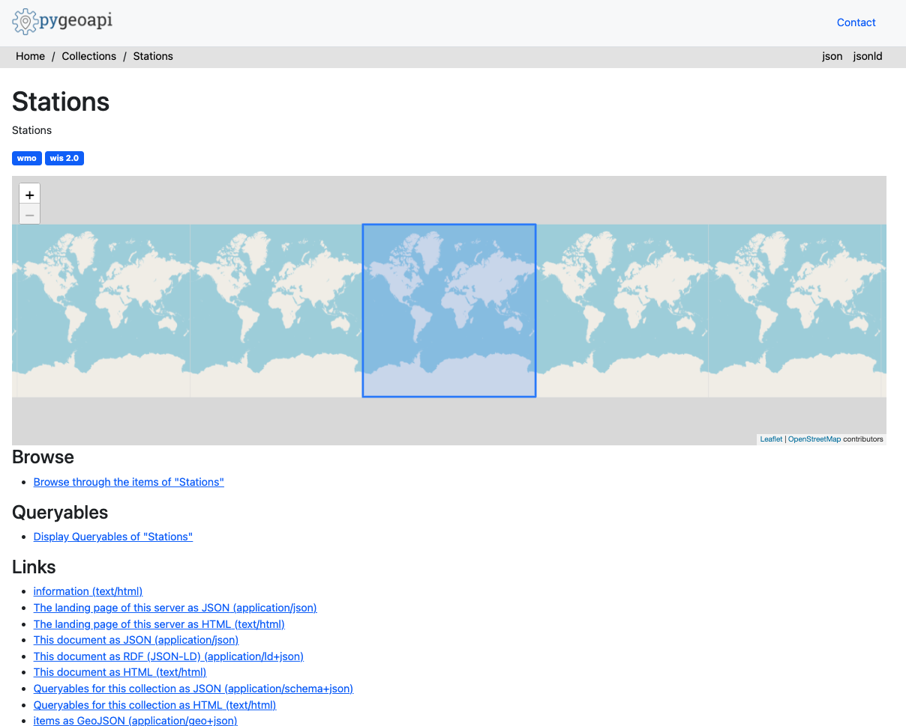

# Abfrage von Daten über die wis2box API

!!! abstract "Lernziele"
    Am Ende dieser praktischen Sitzung werden Sie in der Lage sein:

    - die wis2box API zu nutzen, um Ihre Stationen abzufragen und zu filtern
    - die wis2box API zu nutzen, um Ihre Daten abzufragen und zu filtern

## Einführung

Die wis2box API bietet Entdeckungs- und Abfragezugriff in maschinenlesbarer Form auf die Daten, die in wis2box aufgenommen wurden. Die API basiert auf dem OGC API - Features Standard und wird mit [pygeoapi](https://pygeoapi.io) implementiert.

Die wis2box API bietet Zugriff auf die folgenden Sammlungen:

- Stationen
- Entdeckungsmetadaten
- Datenbenachrichtigungen
- plus eine Sammlung pro konfiguriertem Datensatz, die die Ausgabe von bufr2geojson speichert (das Plugin `bufr2geojson` muss in der Datenzuordnungskonfiguration aktiviert sein, um die Elemente in der Datensatzsammlung zu füllen).

In dieser praktischen Sitzung lernen Sie, wie Sie die Daten-API verwenden können, um Daten zu durchsuchen und abzufragen, die in wis2box aufgenommen wurden.

## Vorbereitung

!!! note
    Navigieren Sie zur wis2box API-Startseite in Ihrem Webbrowser:

    `http://<your-host>/oapi`

## Sammlungen inspizieren

Klicken Sie auf der Startseite auf den Link 'Collections'.

!!! question
    Wie viele Datensatzsammlungen sehen Sie auf der resultierenden Seite? Was denken Sie, was jede Sammlung darstellt?

??? success "Klicken Sie, um die Antwort anzuzeigen"
    Es sollten 4 Sammlungen angezeigt werden, darunter "Stations", "Discovery metadata" und "Data notifications"

## Stationen inspizieren

Klicken Sie auf der Startseite auf den Link 'Collections' und dann auf den Link 'Stations'.

Klicken Sie auf den Link 'Browse' und dann auf den Link 'json'.

!!! question
    Wie viele Stationen werden zurückgegeben? Vergleichen Sie diese Zahl mit der Stationsliste unter `http://<your-host>/wis2box-webapp/station`

??? success "Klicken Sie, um die Antwort anzuzeigen"
    Die Anzahl der Stationen aus der API sollte gleich der Anzahl der Stationen sein, die Sie in der wis2box-Webapp sehen.

!!! question
    Wie können wir nach einer einzelnen Station suchen (z.B. `Balaka`)?

??? success "Klicken Sie, um die Antwort anzuzeigen"
    Fragen Sie die API mit `http://<your-host>/oapi/collections/stations/items?q=Balaka` ab.

!!! note
    Das obige Beispiel basiert auf den Testdaten aus Malawi. Versuchen Sie, gegen die Stationen zu testen, die Sie im Rahmen der vorherigen Übungen aufgenommen haben.

## Beobachtungen inspizieren

!!! note
    Das obige Beispiel basiert auf den Testdaten aus Malawi. Versuchen Sie, gegen die Beobachtungen zu testen, die Sie im Rahmen der Übungen aufgenommen haben.

Klicken Sie auf der Startseite auf den Link 'Collections' und dann auf den Link 'Surface weather observations from Malawi'.

Klicken Sie auf den Link 'Queryables'.

!!! question
    Welche Abfragemöglichkeit würde verwendet werden, um nach Stationskennung zu filtern?

??? success "Klicken Sie, um die Antwort anzuzeigen"
    Der `wigos_station_identifer` ist die richtige Abfragemöglichkeit.

Navigieren Sie zur vorherigen Seite (d.h. `http://<your-host>/oapi/collections/urn:wmo:md:mwi:mwi_met_centre:surface-weather-observations`)

Klicken Sie auf den Link 'Browse'.

!!! question
    Wie können wir die JSON-Antwort visualisieren?

??? success "Klicken Sie, um die Antwort anzuzeigen"
    Indem Sie auf den Link 'JSON' oben rechts auf der Seite klicken oder indem Sie `f=json` zur API-Anfrage im Webbrowser hinzufügen.

Überprüfen Sie die JSON-Antwort der Beobachtungen.

!!! question
    Wie viele Datensätze werden zurückgegeben?

!!! question
    Wie können wir die Antwort auf 3 Beobachtungen beschränken?

??? success "Klicken Sie, um die Antwort anzuzeigen"
    Fügen Sie `limit=3` zur API-Anfrage hinzu.

!!! question
    Wie können wir die Antwort nach den neuesten Beobachtungen sortieren?

??? success "Klicken Sie, um die Antwort anzuzeigen"
    Fügen Sie `sortby=-resultTime` zur API-Anfrage hinzu (beachten Sie das `-`-Zeichen, um die absteigende Sortierreihenfolge anzugeben). Um nach den frühesten Beobachtungen zu sortieren, aktualisieren Sie die Anfrage, um `sortby=resultTime` einzuschließen.

!!! question
    Wie können wir die Beobachtungen nach einer einzelnen Station filtern?

??? success "Klicken Sie, um die Antwort anzuzeigen"
    Fügen Sie `wigos_station_identifier=<WSI>` zur API-Anfrage hinzu.

!!! question
    Wie können wir die Beobachtungen als CSV erhalten?

??? success "Klicken Sie, um die Antwort anzuzeigen"
    Fügen Sie `f=csv` zur API-Anfrage hinzu.

!!! question
    Wie können wir eine einzelne Beobachtung (ID) anzeigen?

??? success "Klicken Sie, um die Antwort anzuzeigen"
    Verwenden Sie die Feature-ID aus einer API-Anfrage gegen die Beobachtungen und fragen Sie die API für `http://<your-host>/oapi/collections/{collectionId}/items/{featureId}` ab, wobei `{collectionId}` der Name Ihrer Beobachtungssammlung und `{itemId}` die Kennung der einzelnen interessierenden Beobachtung ist.

## Fazit

!!! success "Herzlichen Glückwunsch!"
    In dieser praktischen Sitzung haben Sie gelernt, wie man:

    - die wis2box API nutzt, um Ihre Stationen abzufragen und zu filtern
    - die wis2box API nutzt, um Ihre Daten abzufragen und zu filtern