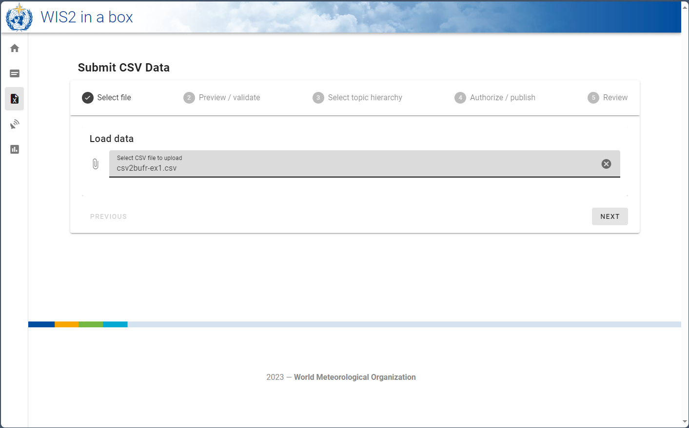

# Conversione dei dati CSV in BUFR

!!! abstract "Risultati di apprendimento"
    Alla fine di questa sessione pratica, sarai in grado di:

    - utilizzare l'**interfaccia MinIO** per caricare file di dati CSV di input e monitorare il risultato
    - conoscere il formato dei dati CSV da utilizzare con il modello BUFR predefinito per stazioni meteorologiche automatiche
    - utilizzare l'editor di dataset nella **webapp wis2box** per creare un dataset per la pubblicazione di messaggi DAYCLI
    - conoscere il formato dei dati CSV da utilizzare con il modello BUFR DAYCLI
    - utilizzare la **webapp wis2box** per validare e convertire dati di esempio per stazioni AWS in BUFR (opzionale)

## Introduzione

I file di dati con valori separati da virgole (CSV) sono spesso utilizzati per registrare dati osservativi e altri dati in formato tabellare. 
La maggior parte dei data logger utilizzati per registrare l'output dei sensori è in grado di esportare le osservazioni in file delimitati, incluso il formato CSV.
Analogamente, quando i dati vengono inseriti in un database, è facile esportare i dati richiesti in file formattati CSV. 
Per facilitare lo scambio di dati originariamente memorizzati in formati di dati tabulari, è stato implementato un convertitore da CSV a BUFR nel 
wis2box utilizzando lo stesso software utilizzato per la conversione da SYNOP a BUFR.

In questa sessione imparerai a utilizzare il convertitore csv2bufr nel wis2box per i seguenti modelli integrati:

- **AWS** (aws-template.json): Modello di mappatura per convertire dati CSV da file semplificato di stazione meteorologica automatica alla sequenza BUFR 301150, 307096"
- **DayCLI** (daycli-template.json): Modello di mappatura per convertire dati climatici giornalieri CSV alla sequenza BUFR 307075

## Preparazione

Assicurati che wis2box-stack sia stato avviato con `python3 wis2box.py start`

Assicurati di avere un browser web aperto con l'interfaccia MinIO per la tua istanza andando su `http://<tuo-host>:9000`
Se non ricordi le tue credenziali MinIO, puoi trovarle nel file `wis2box.env` nella directory `wis2box-1.0.0rc1` sulla tua VM studente.

Assicurati di avere MQTT Explorer aperto e connesso al tuo broker utilizzando le credenziali `everyone/everyone`.

## Esercizio 1: Utilizzo di csv2bufr con il modello 'AWS'

Il modello 'AWS' fornisce un modello di mappatura predefinito per convertire dati CSV dalle stazioni AWS a supporto dei requisiti di segnalazione GBON.

La descrizione del modello AWS può essere trovata [qui](/csv2bufr-templates/aws-template).

### Revisione dei dati di input aws-example

Scarica l'esempio per questo esercizio dal link sottostante:

[aws-example.csv](/sample-data/aws-example.csv)

Apri il file scaricato in un editor e ispeziona il contenuto:

!!! question
    Esaminando i campi di data, ora e identificazione (identificatori WIGOS e tradizionali) cosa 
    noti? Come verrebbe rappresentata la data odierna?

??? success "Clicca per rivelare la risposta"
    Ogni colonna contiene un singolo pezzo di informazione. Ad esempio, la data è suddivisa in
    anno, mese e giorno, rispecchiando come i dati sono memorizzati in BUFR. La data odierna sarebbe 
    suddivisa nelle colonne "year", "month" e "day". Analogamente, l'ora deve essere
    suddivisa in "hour" e "minute" e l'identificatore della stazione WIGOS nei suoi rispettivi componenti.

!!! question
    Guardando il file di dati, come vengono codificati i dati mancanti?
    
??? success "Clicca per rivelare la risposta"
    I dati mancanti all'interno del file sono rappresentati da celle vuote. In un file CSV questo sarebbe
    codificato come ``,,``. Nota che questa è una cella vuota e non codificata come una stringa di lunghezza zero, 
    ad esempio ``,"",``.

!!! hint "Dati mancanti"
    È riconosciuto che i dati possono mancare per vari motivi, sia a causa di guasti dei sensori 
    sia perché il parametro non viene osservato. In questi casi, i dati mancanti possono essere codificati
    come nella risposta sopra, gli altri dati nel rapporto rimangono validi.

!!! question
    Quali sono gli identificatori di stazione WIGOS per le stazioni che riportano dati nel file di esempio? Come sono definiti nel file di input?

??? success "Clicca per rivelare la risposta"

    L'identificatore di stazione WIGOS è definito da 4 colonne separate nel file:

    - **wsi_series**: Serie identificativa WIGOS
    - **wsi_issuer**: Emittente dell'identificatore WIGOS
    - **wsi_issue_number**: Numero di emissione WIGOS
    - **wsi_local**: Identificatore locale WIGOS

    Gli identificatori di stazione WIGOS utilizzati nel file di esempio sono `0-20000-0-60351`, `0-20000-0-60355` e `0-20000-0-60360`.	

### Aggiorna il file di esempio

Aggiorna il file di esempio che hai scaricato per utilizzare la data e l'ora odierne e cambia gli identificatori di stazione WIGOS per utilizzare le stazioni che hai registrato nella webapp wis2box.

### Carica i dati su MinIO e controlla il risultato

Naviga nell'interfaccia MinIO e accedi utilizzando le credenziali dal file `wis2box.env`.

Naviga in **wis2box-incoming** e clicca sul pulsante "Create new path":

Crea una nuova cartella nel bucket MinIO che corrisponda all'ID del dataset che hai creato con il modello='weather/surface-weather-observations/synop':

Carica il file di esempio che hai scaricato nella cartella che hai creato nel bucket MinIO:

Controlla il dashboard Grafana su `http://<tuo-host>:3000` per vedere se ci sono AVVISI o ERRORI. Se ne vedi, prova a correggerli e ripeti l'esercizio.

Controlla MQTT Explorer per vedere se ricevi notifiche di dati WIS2.

Se hai caricato correttamente i dati, dovresti vedere 3 notifiche in MQTT explorer sul topic `origin/a/wis2/<centre-id>/data/weather/surface-weather-observations/synop` per le 3 stazioni per cui hai riportato dati:

## Esercizio 2 - Utilizzo del modello 'DayCLI'

Nell'esercizio precedente abbiamo utilizzato il dataset che hai creato con Data-type='weather/surface-weather-observations/synop', che ha preconfigurato il modello di conversione da CSV a BUFR al modello AWS.

Nel prossimo esercizio utilizzeremo il modello 'DayCLI' per convertire dati climatici giornalieri in BUFR.

La descrizione del modello DAYCLI può essere trovata [qui](/csv2bufr-templates/daycli-template).

!!! Note "Sul modello DAYCLI"
    Si prega di notare che la sequenza BUFR DAYCLI sarà aggiornata durante il 2025 per includere informazioni aggiuntive e flag QC rivisti. Il modello DAYCLI incluso nel wis2box sarà aggiornato per riflettere queste modifiche. La WMO comunicherà quando il software wis2box sarà aggiornato per includere il nuovo modello DAYCLI, per consentire agli utenti di aggiornare i loro sistemi di conseguenza.

### Creazione di un dataset wis2box per la pubblicazione di messaggi DAYCLI

Vai all'editor di dataset nella webapp wis2box e crea un nuovo dataset. Usa lo stesso centre-id delle sessioni pratiche precedenti e seleziona **Data Type='climate/surface-based-observations/daily'**:

Clicca su "CONTINUE TO FORM" e aggiungi una descrizione per il tuo dataset, imposta il riquadro di delimitazione e fornisci le informazioni di contatto per il dataset. Una volta completata la compilazione di tutte le sezioni, clicca su 'VALIDATE FORM' e controlla il modulo.

Rivedi i plugin di dati per i dataset. Clicca su "UPDATE" accanto al plugin con nome "CSV data converted to BUFR" e vedrai che il modello è impostato su **DayCLI**:

Chiudi la configurazione del plugin e invia il modulo utilizzando il token di autenticazione che hai creato nella sessione pratica precedente.

Ora dovresti avere un secondo dataset nella webapp wis2box configurato per utilizzare il modello DAYCLI per convertire dati CSV in BUFR.

### Revisione dei dati di input daycli-example

Scarica l'esempio per questo esercizio dal link sottostante:

[daycli-example.csv](/sample-data/daycli-example.csv)

Apri il file scaricato in un editor e ispeziona il contenuto:

!!! question
    Quali variabili aggiuntive sono incluse nel modello daycli?

??? success "Clicca per rivelare la risposta"
    Il modello daycli include importanti metadati sul posizionamento degli strumenti e sulle classificazioni di qualità delle misurazioni per temperatura e umidità, flag di controllo qualità e informazioni su come è stata calcolata la temperatura media giornaliera.

### Aggiorna il file di esempio

Il file di esempio contiene una riga di dati per ogni giorno del mese e riporta dati per una stazione. Aggiorna il file di esempio che hai scaricato per utilizzare la data e l'ora odierne e cambia gli identificatori di stazione WIGOS per utilizzare una stazione che hai registrato nella webapp wis2box.

### Carica i dati su MinIO e controlla il risultato

Come prima, dovrai caricare i dati nel bucket 'wis2box-incoming' in MinIO per essere elaborati dal convertitore csv2bufr. Questa volta dovrai creare una nuova cartella nel bucket MinIO che corrisponda all'ID del dataset che hai creato con il modello='climate/surface-based-observations/daily', che sarà diverso dall'ID del dataset che hai utilizzato nell'esercizio precedente:

Dopo aver caricato i dati, verifica che non ci siano AVVISI o ERRORI nel dashboard Grafana e controlla MQTT Explorer per vedere se ricevi notifiche di dati WIS2.

Se hai caricato correttamente i dati, dovresti vedere 30 notifiche in MQTT explorer sul topic `origin/a/wis2/<centre-id>/data/climate/surface-based-observations/daily` per i 30 giorni del mese per cui hai riportato dati:

## Esercizio 3 - utilizzo del modulo CSV nella webapp wis2box (opzionale)

L'applicazione web wis2box fornisce un'interfaccia per caricare dati CSV e convertirli in BUFR prima di pubblicarli su WIS2, utilizzando il modello AWS.

L'uso di questo modulo è destinato a scopi di debug e validazione; il metodo di invio consigliato per la pubblicazione di dati dalle stazioni meteorologiche automatiche è configurare un processo che carichi automaticamente i dati nel bucket MinIO.

### Utilizzo del modulo CSV nell'applicazione web wis2box

Naviga al modulo CSV nell'applicazione web wis2box 
(``http://<nome-tuo-host>/wis2box-webapp/csv2bufr_form``).
Usa il file [aws-example.csv](/sample-data/aws-example.csv) per questo esercizio.
Ora dovresti essere in grado di cliccare su "next" per visualizzare in anteprima e validare il file.

Cliccando sul pulsante "next" si carica il file nel browser e si convalida il contenuto rispetto a uno schema predefinito. 
Nessun dato è ancora stato convertito o pubblicato. Nella scheda di anteprima/convalida dovresti vedere un elenco di avvisi 
sui dati mancanti, ma in questo esercizio possono essere ignorati. 

Clicca su *next* per procedere e ti verrà chiesto di fornire un ID dataset per i dati da pubblicare. Seleziona l'ID dataset che hai creato in precedenza e clicca su *next*.

Ora dovresti essere su una pagina di autorizzazione dove ti verrà chiesto di inserire il token ``processes/wis2box`` 
che hai creato in precedenza. Inserisci questo token e clicca sul toggle "Publish on WIS2" per assicurarti 
che "Publish to WIS2" sia selezionato (vedi screenshot sotto).

Clicca su "next"