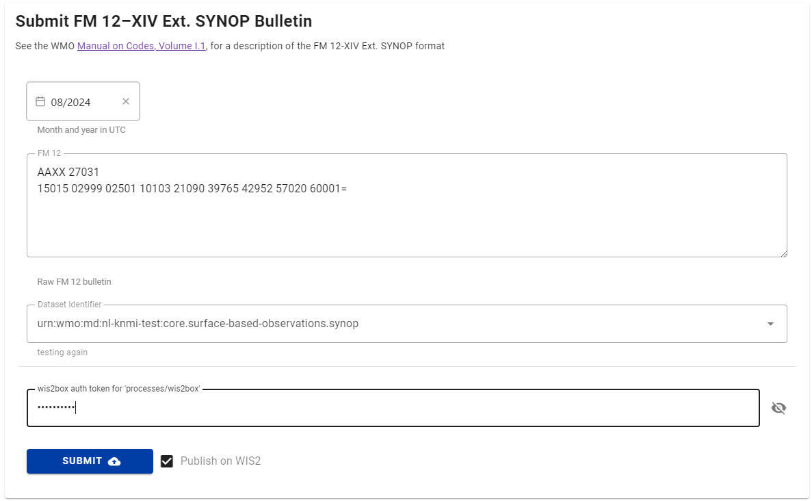

# Conversione dei dati SYNOP in BUFR utilizzando wis2box-webapp

!!! abstract "Risultati di apprendimento"
    Alla fine di questa sessione pratica, sarai in grado di:

    - inviare bollettini FM-12 SYNOP validi tramite l'applicazione web wis2box per la conversione in BUFR e lo scambio su WIS2.0
    - convalidare, diagnosticare e correggere semplici errori di codifica in un bollettino FM-12 SYNOP prima della conversione del formato e dello scambio
    - assicurare che i metadati della stazione richiesti siano disponibili nel wis2box
    - confermare e ispezionare i bollettini convertiti con successo

## Introduzione

Per consentire agli osservatori manuali di inviare dati direttamente al WIS2.0, il wis2box-webapp ha un modulo per convertire i bollettini FM-12 SYNOP in BUFR. Il modulo consente inoltre agli utenti di diagnosticare e correggere semplici errori di codifica nel bollettino FM-12 SYNOP prima della conversione del formato e dello scambio, e di ispezionare i dati BUFR risultanti.

## Preparazione

!!! warning "Prerequisiti"

    - Assicurati che il tuo wis2box sia stato configurato e avviato.
    - Apri un terminale e connettiti alla tua VM studente utilizzando SSH.
    - Connettiti al broker MQTT della tua istanza wis2box utilizzando MQTT Explorer.
    - Apri l'applicazione web wis2box (`http://<tuo-nome-host>/wis2box-webapp`) e assicurati di aver effettuato l'accesso.

## Utilizzo di wis2box-webapp per convertire FM-12 SYNOP in BUFR

### Esercizio 1 - utilizzo di wis2box-webapp per convertire FM-12 SYNOP in BUFR

Assicurati di avere il token di autenticazione per "processes/wis2box" che hai generato nell'esercizio precedente e di essere connesso al tuo broker wis2box in MQTT Explorer.

Copia il seguente messaggio:
    
``` {.copy}
AAXX 27031
15015 02999 02501 10103 21090 39765 42952 57020 60001=
``` 

Apri l'applicazione web wis2box e naviga alla pagina synop2bufr utilizzando il menu di navigazione a sinistra e procedi come segue:

- Incolla il contenuto che hai copiato nella casella di inserimento testo.
- Seleziona il mese e l'anno utilizzando il selettore di data, supponi il mese corrente per questo esercizio.
- Seleziona un argomento dal menu a discesa (le opzioni si basano sui dataset configurati nel wis2box).
- Inserisci il token di autenticazione "processes/wis2box" che hai generato in precedenza
- Assicurati che "Pubblica su WIS2" sia attivato
- Clicca su "INVIA"

<center></center>

Clicca su invia. Riceverai un messaggio di avviso poiché la stazione non è registrata nel wis2box. Vai all'editor delle stazioni e importa la seguente stazione:

``` {.copy}
0-20000-0-15015
```

Assicurati che la stazione sia associata all'argomento selezionato nel passaggio precedente e poi torna alla pagina synop2bufr e ripeti il processo con gli stessi dati di prima.

!!! question
    Come puoi vedere il risultato della conversione da FM-12 SYNOP a BUFR?

??? success "Clicca per rivelare la risposta"
    La sezione dei risultati della pagina mostra Avvisi, Errori e File BUFR di output.

    Clicca su "File BUFR di output" per vedere un elenco dei file che sono stati generati. Dovresti vedere un file elencato.

    Il pulsante di download consente di scaricare i dati BUFR direttamente sul tuo computer.

    Il pulsante di ispezione esegue un processo per convertire ed estrarre i dati da BUFR.

    <center></center>

!!! question
    I dati di input FM-12 SYNOP non includevano la posizione della stazione, l'elevazione o l'altezza del barometro. 
    Conferma che questi siano nei dati BUFR di output, da dove provengono?

??? success "Clicca per rivelare la risposta"
    Cliccando sul pulsante di ispezione dovrebbe apparire una finestra di dialogo come quella mostrata di seguito.

    <center></center>

    Questo include la posizione della stazione mostrata su una mappa e i metadati di base, nonché le osservazioni nel messaggio.
    
    Come parte della trasformazione da FM-12 SYNOP a BUFR, sono stati aggiunti metadati aggiuntivi al file BUFR.
    
    Il file BUFR può anche essere ispezionato scaricando il file e convalidandolo utilizzando uno strumento come il validatore BUFR ecCodes di ECMWF.

Vai su MQTT Explorer e controlla l'argomento delle notifiche WIS2 per vedere le notifiche WIS2 che sono state pubblicate.

### Esercizio 2 - comprensione dell'elenco delle stazioni

Per questo prossimo esercizio convertirai un file contenente più rapporti, vedi i dati di seguito:

``` {.copy}
AAXX 27031
15015 02999 02501 10103 21090 39765 42952 57020 60001=
15020 02997 23104 10130 21075 30177 40377 58020 60001 81041=
15090 02997 53102 10139 21075 30271 40364 58031 60001 82046=
```

!!! question
    Basandoti sull'esercizio precedente, guarda il messaggio FM-12 SYNOP e prevedi quanti messaggi BUFR di output saranno generati. 
    
    Ora copia e incolla questo messaggio nel modulo SYNOP e invia i dati.

    Il numero di messaggi generati corrisponde alla tua aspettativa e se no, perché?

??? warning "Clicca per rivelare la risposta"
    
    Potresti aver previsto che sarebbero stati generati tre messaggi BUFR, uno per ogni rapporto meteorologico. Tuttavia, invece hai ricevuto 2 avvisi e solo un file BUFR.
    
    Affinché un rapporto meteorologico venga convertito in BUFR, sono necessari i metadati di base contenuti nell'elenco delle stazioni. Mentre l'esempio sopra include tre rapporti meteorologici, due delle tre stazioni che riportano non erano registrate nel tuo wis2box. 
    
    Di conseguenza, solo uno dei tre rapporti meteorologici ha generato un file BUFR e una notifica WIS2 è stata pubblicata. Gli altri due rapporti meteorologici sono stati ignorati e sono stati generati avvisi.

!!! hint
    Prendi nota della relazione tra l'Identificatore WIGOS e l'identificatore tradizionale della stazione incluso nell'output BUFR. In molti casi, per le stazioni elencate nel WMO-No. 9 Volume A al momento della migrazione agli identificatori di stazione WIGOS, l'identificatore della stazione WIGOS è dato dall'identificatore tradizionale della stazione con ``0-20000-0`` anteposto, ad esempio ``15015`` è diventato ``0-20000-0-15015``.

Utilizzando la pagina dell'elenco delle stazioni, importa le seguenti stazioni:

``` {.copy}
0-20000-0-15020
0-20000-0-15090
```

Assicurati che le stazioni siano associate all'argomento selezionato nell'esercizio precedente e poi torna alla pagina synop2bufr e ripeti il processo.

Ora dovrebbero essere generati tre file BUFR e non dovrebbero esserci avvisi o errori elencati nell'applicazione web.

Oltre alle informazioni di base sulla stazione, metadati aggiuntivi come l'elevazione della stazione sul livello del mare e l'altezza del barometro sul livello del mare sono necessari per la codifica in BUFR. I campi sono inclusi nelle pagine dell'elenco delle stazioni e dell'editor delle stazioni.
    
### Esercizio 3 - debug

In questo ultimo esercizio identificherai e correggerai due dei problemi più comuni incontrati quando si utilizza questo strumento per convertire FM-12 SYNOP in BUFR.

I dati di esempio sono mostrati nella casella sottostante, esamina i dati e cerca di risolvere eventuali problemi che potrebbero esserci prima di inviare i dati attraverso l'applicazione web.

!!! hint
    Puoi modificare i dati nella casella di inserimento sulla pagina dell'applicazione web. Se ti sfugge qualche problema, questi dovrebbero essere rilevati e evidenziati come avviso o errore una volta che il pulsante di invio è stato cliccato.

``` {.copy}
AAXX 27031
15015 02999 02501 10103 21090 39765 42952 57020 60001
15020 02997 23104 10130 21075 30177 40377 58020 60001 81041=
15090 02997 53102 10139 21075 30271 40364 58031 60001 82046=
```

!!! question
    Quali problemi ti aspettavi di incontrare durante la conversione dei dati in BUFR e come li hai superati? Ci sono stati problemi che non ti aspettavi?

??? success "Clicca per rivelare la risposta"
    In questo primo esempio il simbolo "fine del testo" (=), o delimitatore di record, manca tra il primo e il secondo rapporto meteorologico. Di conseguenza, le righe 2 e 3 vengono trattate come un unico rapporto, portando a errori nell'analisi del messaggio.

Il secondo esempio qui sotto contiene diversi problemi comuni trovati nei rapporti FM-12 SYNOP. Esamina i dati e cerca di identificare i problemi, quindi invia i dati corretti attraverso l'applicazione web.

```{.copy}
AAXX 27031
15020 02997 23104 10/30 21075 30177 40377 580200 60001 81041=
```

!!! question
    Quali problemi hai trovato e come li hai risolti?

??? success "Clicca per rivelare la risposta"
    Ci sono due problemi nel rapporto meteorologico. 
    
    Il primo, nel gruppo della temperatura dell'aria con segno, ha il carattere delle decine impostato come mancante (/), portando a un gruppo non valido. In questo esempio sappiamo che la temperatura è di 13,0 gradi Celsius (dagli esempi precedenti) e quindi questo problema può essere corretto. Operativamente, il valore corretto dovrebbe essere confermato con l'osservatore.

    Il secondo problema si verifica nel gruppo 5 dove c'è un carattere aggiuntivo, con il carattere finale duplicato. Questo problema può essere risolto rimuovendo il carattere extra.

## Pulizia

Durante gli esercizi in questa sessione avrai importato diversi file nel tuo elenco di stazioni. Naviga alla pagina dell'elenco delle stazioni e clicca sulle icone del cestino per eliminare le stazioni. Potrebbe essere necessario aggiornare la pagina per far rimuovere le stazioni dall'elenco dopo l'eliminazione.

<center></center>

## Conclusione

!!! success "Congratulazioni!"

    In questa sessione pratica, hai imparato:

    - come lo strumento synop2bufr può essere utilizzato per convertire i rapporti FM-12 SYNOP in BUFR;
    - come inviare un rapporto FM-12 SYNOP attraverso la web-app;
    - come diagnosticare e correggere semplici errori in un rapporto FM-12 SYNOP;
    - l'importanza di registrare le stazioni nel wis2box (e in OSCAR/Surface);
    - e l'uso del pulsante di ispezione per visualizzare il contenuto dei dati BUFR.